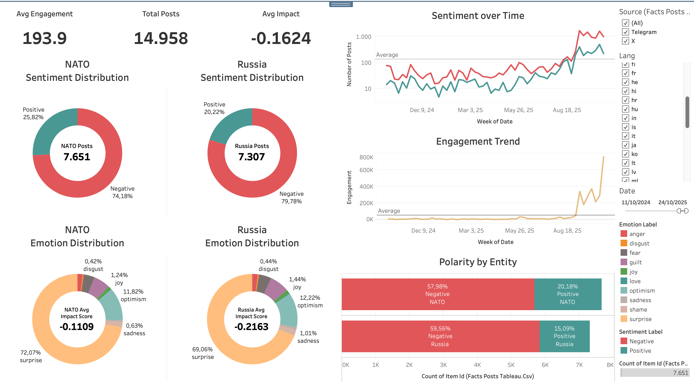
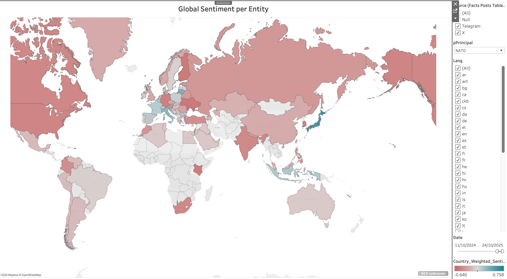
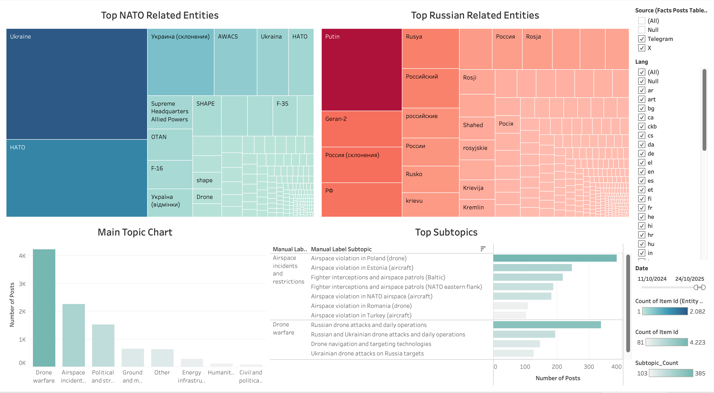

# SOCIAL ANALYSIS PROJECT · TELEGRAM + X

Multichannel social analytics pipeline built with Python. This repo is the second part of the repository `telegram-scraper` which produces all the raw data which will be used in this step. This pipeline ingests Telegram and X/Twitter exports, cleans and unifies both sources, scores multilingual sentiment and zero-shot emotions, extracts entity-conditioned context, fits BERTopic, and builds an interaction graph for X. Outputs are optimized for Tableau and Gephi.

## Overview
- Flexible CSV ingestion for Telegram and X with resilient column alias detection.
- Unified preprocessing pipeline in `src/preprocessing.py` that normalizes metrics, text fields, and strips any global sentiment/emotion columns so only entity-scoped metrics propagate downstream.
- Hugging Face models: sentiment (`cardiffnlp/twitter-xlm-roberta-base-sentiment`) and emotions (`joeddav/xlm-roberta-large-xnli` by default) with entity-level scoring powered by editable alias maps for NATO/Russia.
- Topic discovery via BERTopic with optional disk cache.
- Entity-aware sentiment/emotion/topic scoring (defaults: NATO/OTAN and Russia) now backed by explicit principal/related alias dictionaries and configurable unknown handling.
- Directed interaction network for X (mentions, replies, retweets, quotes) exported as `.gexf` plus metrics.

## Repository Layout
```text
social-analysis-project/
├── data/
│   ├── raw/                                          # place telegram.csv, x.csv or other raw exports here
│   ├── processed/                                    # pipeline outputs (csv: facts_posts, geo_country_exploded, facts_posts_tableau, emotions_long, all_platforms)
│   └── ground_truth/                                 # manual labelled data which helps fine-tuning (CSV, UTF-8 with BOM)
├── models/
│   ├── bertopic/                                   # optional BERTopic cache (created at runtime)
│   ├── sentiment_finetuned/                        # fine-tuned targeted sentiment checkpoint (loaded automatically if present)
│   └── topic_classifier/                           # sentence-transformer classifier for manual topic/subtopic labels
├── results/
│   ├── graphs/                                     # network metrics and GEXF graphs
│   └── topics/                                      # BERTopic summaries and metadata
├── scripts/
│   ├── process_all.py                   # main entry point (pipeline + label merge)
│   ├── finetune_sentiment.py            # fine-tune Hugging Face sentiment model once enough ground truth exists
│   ├── finetune_topic_classifier.py     # trains the manual topic/subtopic classifier (optional CV)
│   └── apply_manual_labels.py           # propagates manual labels from topics_manual_labels.csv to processed CSVs
├── src/                                               # reusable library modules
│   ├── preprocessing.py
│   ├── sentiment.py
│   ├── emotions.py
│   ├── entity_analysis.py
│   ├── entities_runtime.py
│   ├── topics_bertopic.py
│   ├── network.py
│   └── utils.py
├── requirements.txt
└── README.md
```
> Empty folders include `.gitkeep` files to preserve the tree.

## Requirements
- Python 3.10 or 3.11 (tested on macOS Apple Silicon).
- `pip`, `venv`, or `conda` for environment management.
- PyTorch (CPU by default; GPU optional via `--device`; MPS en Apple Silicon con `--device -2`).
- First run requires internet access to download Hugging Face models.

## Quick Setup
```bash
python -m venv .venv
source .venv/bin/activate  # Windows: .venv\Scripts\activate
pip install --upgrade pip
pip install -r requirements.txt
```

## Expected Inputs
### Telegram (`data/raw/telegram.csv`)
- Required columns detected automatically: `timestamp`, `channel`, `messageId`, `summary/text`.
- Metric aliases (`reactions`, `forwards`, `views`, etc.) are mapped to the unified analytics columns `likes`, `retweets`, `replies`, `quotes`, `views`.
- Generates cleaned fields such as `text_clean`, `emoji_count`, `uid`, `link`.

### X / Twitter (`data/raw/x.csv`)
- Detects aliases for `Tweet ID`, `URL`, `Content`, `Author`, `Language`, metrics, and dates.
- Missing `Tweet ID` values are inferred from URLs or replaced with a deterministic hash.
- Normalizes dates to `YYYY-MM-DD` and extracts emojis/mentions when available.

Both readers accept `, ; \t |` separators, UTF-8 with or without BOM, and skip malformed lines with `on_bad_lines="skip"`.

## Running the Pipeline
```bash
python scripts/process_all.py \
  --telegram data/raw/telegram.csv \
  --x data/raw/x.csv \
  --device -1 \
  --max_rows 0 \
  --emotion_model joeddav/xlm-roberta-large-xnli \
  --entities "OTAN,Rusia" \
  --entity_window 160
```

Key parameters:
- `--telegram`, `--x`: CSV file paths (optional per platform).
- `--max_rows`: limit rows for smoke tests (`0` keeps all data).
- `--device`: GPU index (0,1,...) o CPU (`-1`). In Apple Silicon use `-2` or `mps` to force Metal (MPS).
- `--emotion_model`: zero-shot model name; switch to `MoritzLaurer/mMiniLMv2-L6-mnli-xnli` for lighter workloads.
- `--entities`: comma-separated list of entity names (aliases inferred automatically).
- `--entities_file`: YAML/JSON/TXT file with custom entity definitions and aliases (not needed).
- `--entity_window`: number of characters captured around each mention for targeted scoring (snippet).

Directories are created on demand through `utils.ensure_dirs`.

## Core Outputs (`data/processed/`)
- `telegram_preprocessed.csv`, `x_preprocessed.csv`: platform snapshots with normalized metrics ready for downstream ingestion.
- `all_platforms.csv`: combined dataset containing topic assignment, aggregated entity metrics, impact_score, cleaned topic text (`text_topic`), and per-row entity mention payloads (JSON).
- `facts_posts.csv`: master table with engagement, stance, impact_score per post, topic terms (`topic_terms`), emotion probabilities (`emotion_prob_*`) towards related entities detected, principal topic labels (`manual_label_topic` / `manual_label_subtopic`). Use `scripts/process_all.py --split-outputs/--no-split-outputs` to control whether the pipeline also writes the standalone `geo_country_exploded.csv` and `facts_posts_tableau.csv` during the main run.
- `facts_posts_tableau.csv`: Tableau-ready fact table including engagement, stance, impact_score per post, topic terms (`topic_terms`), expanded emotion probabilities (`emotion_prob_*`) and `related_entities` lists such as `"Prime Minister - Russia"`, without geo columns.
- `geo_country_exploded.csv`: exploded per-country distribution per `item_id` and specifies the method applied (the 100% it has used heuristic methods as used APIs didn't provide explicit location).
- `emotions_long.csv`: tidy emotion probabilities (`item_id`, `emotion`, `prob`). They are overall emotions and not entity-oriented.
- `topics_assignments.csv`, `topics_summary_daily.csv`: BERTopic assignments and daily evolution, enriched with `manual_label_topic` and `manual_label_subtopic` (either curated or model-predicted).
- `entity_mentions.csv`, `entity_topic_summary.csv`: entity-conditioned sentiment, stance, impact_score, and emotion aggregations.
- `x_edges.csv`: edge list for Tableau/Gephi workflows.
- `../results/graphs/x_nodes_metrics.csv`, `../results/graphs/x_interactions.gexf`: network metrics and GEXF graph.
- `../results/topics/topic_info.csv`: topic catalogue exported by BERTopic.
- `data/ground_truth/entity_sentiment_finetune.csv`, `data/ground_truth/topics_manual_finetune.csv`: auto-generated once the manual ground truth surpasses >200 entity mentions or >200 topics.

> All CSV files use `;` as separator and `utf-8-sig` encoding for compatibility with Excel/Tableau.

## Key Components
- `src/preprocessing.py`: resilient CSV loaders, date normalization, emoji extraction, unified schema (`unify_frames`), and multilingual stopword removal/lemmatization for topic modeling (`text_topic`).
- `src/sentiment.py`: batch wrapper around the multilingual sentiment pipeline (XLM-R) returning full distributions. If `models/sentiment_finetuned/` exists, the fine-tuned checkpoint is loaded automatically.
- `src/emotions.py`: multilingual zero-shot classifier with configurable batches and model name.
- `src/network.py`: builds the directed X graph and exports metrics/edges.
- `src/topics_bertopic.py`: trains or reloads BERTopic with custom multilingual stopword-aware vectorization, transforms documents, and summarizes topics over time.
- `src/entities_runtime.py`: loads entities from CLI arguments or auxiliary files.
- `src/entity_analysis.py`: detects mentions, scores targeted sentiment/emotions, and aggregates by entity/topic.
- `src/utils.py`: shared helpers (directory creation, source normalization, Tableau-friendly CSV export).
- `scripts/apply_manual_labels.py`: synchronises manual topic labels across processed datasets and produces the missing-label checklist.

## Topic Labelling Workflow

1. **Finetune the model to your context or needs (optional but recommended)**
  If you have a previous labelled data, you can add it to `results/topics/topic_backup/` with name structure `topics_manual_labels_latest.csv`. Then execute the following pipeline:
   - `python scripts/topics_map_labels.py --topic-info results/topics/topic_info.csv` brings the latest BERTopic catalogue together with the historical backups under `results/topics/topic_backup/` and writes `data/ground_truth/topics_manual_labels.csv`.
   If you don't have labelled data, you can add it manually following the logic of .csv files in `data/ground_truth/`.
   - `python scripts/apply_manual_labels.py` propagates those curated labels into every `data/processed/*.csv` that carries topic columns and generates `results/topics/topics_missing_manual_labels.csv` so you know which clusters still require review.

2. **Train or refresh the classifier**
   - You can train without cross-validation:
     ```bash
     python scripts/finetune_topic_classifier.py --min-samples-per-class 5 --cv-folds 0
     ```
   - Or enable stratified K-fold validation (prints per-fold macro accuracy/F1):
     ```bash
     python scripts/finetune_topic_classifier.py --min-samples-per-class 5 --cv-folds 5
     ```
   - Under the hood, the script embeds `text_clean` with `sentence-transformers/paraphrase-multilingual-MiniLM-L12-v2` and fits two balanced `LogisticRegression` models (one for `manual_label_topic`, one for `manual_label_subtopic`). Using cross-validation changes only the evaluation step; the final models are trained on the full dataset and saved to `models/topic_classifier/topic_classifier.joblib`. The classifier only predicts `manual_label_topic` / `manual_label_subtopic`; it never overwrites `topic_id`. It complies with imposed hierarchy topic -> subtopic, what means that an specific subtopic will be always under the same topic.

3. **Run the full pipeline**
   - `python scripts/process_all.py ...`
   - In addition to ingesting data, fitting BERTopic, and exporting dashboards, the script performs a final pass (registered via `atexit`) that merges the manual table plus classifier predictions back into every processed CSV and `results/topics/topic_info.csv`.

4. **Iterate**
   - Inspect `results/topics/topics_missing_manual_labels.csv` to identify the next clusters to annotate and increase model performance.
   - Add the new labels in `facts_posts.csv`, rerun `apply_manual_labels.py`, retrain the classifier, and execute `process_all.py` again. Coverage improves with every loop while preserving human supervision.

## Sentiment Fine-Tuning Workflow
- `data/ground_truth/entity_sentiment_labels.csv` stores the manually curated examples per entity (`snippet`, `entity`, `sentiment_manual`, notes). Each mention is labeled independently, even if multiple entities are discussed in the same post.
- `scripts/finetune_sentiment.py` reads that CSV directly and builds target-aware inputs in the form `[ENTITY] <principal/alias> ||| <snippet>`, using `alias_hit` when available.
- Training runs on XLM-R (`cardiffnlp/twitter-xlm-roberta-base-sentiment` by default) with `max_length=512` to preserve as much context as possible, and writes the checkpoint to `models/sentiment_finetuned/`. In this case, having tweets or telegram messages make the snippet usually the same for every entity detected. In such case, train the sentiment model is important to distinguish "which is relevant to whom". 
- Recommended run:
  ```bash
  python scripts/finetune_sentiment.py \
    --group-split \
    --use-class-weights
  ```
  - `--group-split` ensures the same `item_id` never appears in both train and eval.
  - `--use-class-weights` applies inverse-frequency weighting so the underrepresented neutral class keeps a voice.
  - Additional knobs: `--ground-truth-path` (alternate CSV), `--max-length`, `--min-rows`, `--epochs`, `--batch-size`, `--use-mps` (opt-in Metal acceleration).
- Training logs `accuracy` and `macro_f1`; `src/sentiment.py` will automatically load the refreshed checkpoint whenever `models/sentiment_finetuned/` exists.

## Topics and Entity Analytics
- BERTopic is trained on the combined `text_topic` corpus (lemmatized + stopword-free); if `models/bertopic/global/` already exists the cached model is reused. Multilingual stopwords have been a  challenge as some words in a language could mean other thing in other language. A fallback has been completely needed with all the manual work that entails. For this reason it has to be finetuned to your specific context if you want to optimise the project.
- Topic assignments populate `topic_id`, `topic_label`, and `topic_score` within the unified dataset.
- Entity analysis supports CLI lists or structured files, persists `entity_mentions` JSON per post for dashboarding, and relies on `explode_entity_mentions` to deduplicate snippets and compute per-principal sentiment/emotion averages before export.
- `entity_topic_summary.csv` stores stance indices/labels, impact_score rollups, and average emotion distributions per `(entity, topic_id)`.
- `aggregate_mentions_per_item` exposes post-level sentiment, stance, impact_score, and entity coverage (`entities_detected`) for dashboards.

## Tableau Dashboards

The processed CSV files are designed to feed a set of interactive Tableau dashboards that visualize sentiment, emotions, topics, entities, and geographical impact. These dashboards provide a full analytical view of how NATO- and Russia-related narratives evolve across Telegram and X, allowing for sentiment comparison, emotional tone tracking, and regional influence assessment.

### 1. Entity Sentiment & Emotion Overview
This dashboard focuses on comparative sentiment and emotional dynamics towards NATO and Russia.
It includes:
- **Global KPIs:** Average engagement, total posts, and overall impact score across all posts.
- **Sentiment Distribution:** Donut charts displaying the percentage of positive and negative posts for NATO and Russia, based on entity-oriented sentiment classification.
- **Emotion Distribution:** Donut charts summarizing the dominant emotional probabilities (e.g., surprise, optimism, joy, sadness) per entity. 
- **Sentiment Over Time:** Line chart showing the weekly evolution of positive and negative sentiment for both entities.
- **Engagement Trend:** Weekly total engagement trend, helping identify peaks of audience attention.
- **Polarity by Entity:** Horizontal bar chart comparing the share of positive vs. negative sentiment per entity.



*Insights:*  
This view allows analysts to identify major fluctuations in sentiment and emotion over time, detect disinformation or propaganda peaks, and correlate engagement trends with real-world events. It emphasizes differences in tone and emotional composition between NATO- and Russia-oriented content.

### 2. Global Sentiment Map
The second dashboard visualizes sentiment geographically.
It combines `geo_country_exploded.csv` with `facts_posts_tableau.csv` via `item_id` to compute weighted averages per country.
- **Map Visualization:** Choropleth map where color intensity represents the average sentiment score towards the selected entity (NATO or Russia).  
  Red tones represent negative sentiment, blue/green tones represent positive sentiment.
- **Parameters:** Dropdown (`pPrincipal`) to toggle between NATO and Russia.  
- **Filters:** Date range, platform (Telegram/X), and language.



*Insights:*  
This map highlights regional variations in sentiment and helps locate geographic clusters of support or hostility.  
It also reflects the effectiveness of language-based geolocation heuristics when explicit coordinates are not available.

### 3. Topics & Related Entities
The final dashboard focuses on contextual themes and entity co-occurrences.
It contains:
- **Top Related Entities:** Two treemaps displaying the most frequent related entities connected to NATO and Russia, derived from `entity_mentions.csv`.  
  NATO-related entities are shown in blue tones; Russia-related entities in red tones.
- **Main Topic Chart:** Bar chart of the top-level manual topics (`manual_label_topic`), showing the most discussed thematic clusters.
- **Top Subtopics:** Bar chart listing the five most frequent subtopics (`manual_label_subtopic`) within selected topics, based on the count of `item_id`.



*Insights:*  
This view reveals the thematic focus of the discourse, identifies what entities are most often mentioned alongside NATO or Russia (e.g., Ukraine, F-16, Putin), and provides a quick overview of the most active subtopics such as “airspace violations” or “drone warfare.”


All views were built with **Tableau Public 2025.2.4**.  

## Best Practices & Troubleshooting
- **Large models:** if memory is constrained, switch to a lighter emotion model or reduce the batch size in the entity scorer (`score_entity_mentions`). GPU usage is encourdaged as 27000 rows can cost 12 hours
- **Sparse graph:** inspect `data/processed/x_edges.csv` to confirm mention/reply extraction in the X export.
- **Date issues:** loaders normalize to `YYYY-MM-DD`; verify `timestamp` if the source includes time zones.
- **Reproducibility:** BERTopic uses a fixed `seed` to stabilize topic assignments.

## Credits
- Models: CardiffNLP and the Hugging Face community.
- Core libraries: `transformers`, `pandas`, `networkx`, `tqdm`, `emoji`, `bertopic`, `sentence-transformers`.
- Author: Rodrigo Medrano (2025).
